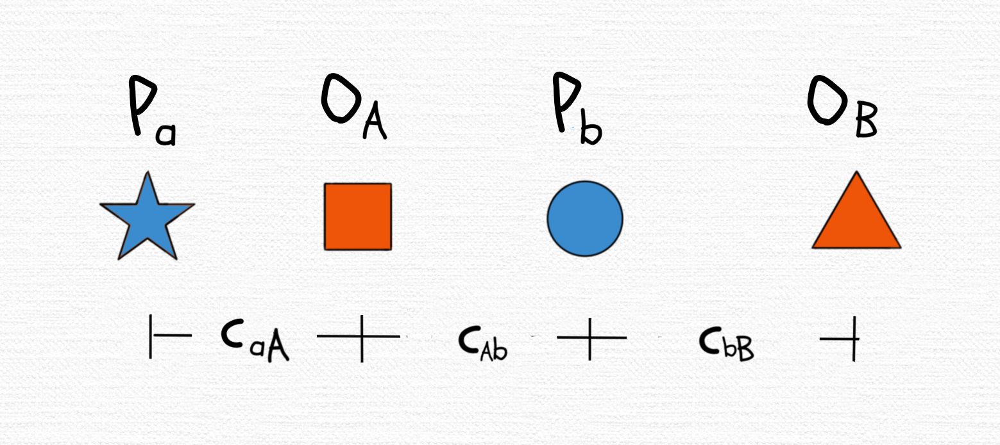

---
output:
  github_document:
    pandoc_args: --webtex
always_allow_html: true
bibliography: bibliography.bib
---

<!-- README.md is generated from README.Rmd. Please edit that file -->

```{r, include = FALSE}
knitr::opts_chunk$set(
  collapse = TRUE,
  comment = "#>"
)
```

```{r preliminary-load-packages, include=FALSE}
library(dplyr) # A Grammar of Data Manipulation
library(ggplot2) # Create Elegant Data Visualisations Using the Grammar of Graphics
library(patchwork) # The Composer of Plots
```

# Workshop

## Introducing spatial availability, a singly-constrained competitive-access accessibility measure

Antonio Paez (School of Earth, Environment and Society, McMaster University, Canada)  
email: paezha@mcmaster.ca  

Anastasia Soukhov (School of Earth, Environment and Society, McMaster University, Canada)  
email: soukhoa@mcmaster.ca  

<!-- badges: start -->
<!-- badges: end -->

<!--
ALL IMAGES WERE CREATED BY ANTONIO USING TAYASUI SKETCHES ON AN IPAD
-->

## Summary

Accessibility measures are widely used to summarize the ease of reaching potential destinations. As such, they combine, into a single summary measure, properties of the land use system, on the one hand, and the transportation system and travel behavior on the other. Defined as the weighted sum of the opportunities that can be reached given the cost of movement, accessibility is used in transportation planning, health planning, economic analysis, etc.

This workshop introduces _spatial availability_. Much like accessibility, spatial availability measures the ease of reaching potential destinations. However, unlike accessibility, it makes opportunities available uniquely to members of the population. For example, a job, once it is available to someone, it is no longer available to somebody else. In effect, spatial availability is a singly-constrained accessibility measure that preserves the number of opportunities.

In this workshop, we explain the intuitions behind spatial availability and describe the mechanisms to implement it. A key to this is the idea of _proportional allocation_, and the use of proportional allocation factors. 

The use of proportional allocation factors as a mechanism for constraining the spatial availability means that the results are easier to interpret than those obtained from accessibility analysis, and they are more intuitive as well.

One exercise is provided, meant to be solved by hand. The workshop finishes with a practical example of implementation in `R`. Data from a real survey in the Greater Toronto and Hamilton Area and use of package {accessibility} give hands-on practice that can serve as a launching pad for your own experiments and applications.

## Materials

- Packages
- [{accessibility}](https://github.com/ipeaGIT/accessibility) (Install from CRAN).
- [{dplyr}](https://dplyr.tidyverse.org/) (Install from CRAN).
- [{ggplot}](https://ggplot2.tidyverse.org/) (Install from CRAN).
- [{leaflet}](https://rstudio.github.io/leaflet/) (Install from CRAN).
- [{patchwork}](https://patchwork.data-imaginist.com/articles/patchwork.html) (Install from CRAN).
- [{sf}](https://r-spatial.github.io/sf/) (Install from CRAN).

- Data (sourced from the Transportation Tomorrow Survey of the Greater Toronto and Hamilton Area)
- [{TTS2016R}](https://soukhova.github.io/TTS2016R/) (Install from GitHub):
```  
remotes::install_github("soukhova/TTS2016R")
```

## Reproducible environment

A reproducible environment was created using [{renv}](). The repository provides all the infrastructure to replicate the environment used to create the workshop. 

The workshop was developed using `R` 4.3.2 ("Eye Holes").

How to use this repository. Install the appropriate version of `R` (make sure to pick the correct operating system) - this is the programming language, it comes as a ‘core package’ here: https://cran.rstudio.com/

Install RStudio (make sure to pick the correct operating system) - this is the an IDE here: https://www.rstudio.com/products/rstudio/download/.

Download the Rtools43 installer (Windows) and run it to install: https://cran.r-project.org/bin/windows/Rtools/rtools43/rtools.html. If using a Mac this may be achieved through installing Xcode (we don't have Macs so not sure if this works, but it should!): https://mac.r-project.org/tools/

Download the code as a .zip file from this repository: https://github.com/paezha/Workshop-Spatial-Availability. Alternatively, if you work with GitHub, you can fork the repository. The repository contains a `renv.lock` file that specifies all the versions of the packages used in the workshop. 

If you downloaded the repository as a .zip file, unzip the file and store it in an apprioriate directory (i.e., NOT the Downloads folder). Use this folder to work on the workshop.

Double click the file called `Workshop-Spatial-Availability.Rproj`. This is be the `R` project for the workshop. This will launch RStudio.

You will see a message in your console saying that your library is out of synch with the lock file. To 'restore' the state of the project to match the versions specified in the `renv.lock` file run the following:

```
renv::restore()
```

Run `renv::status()` in the `R` Console. The output should show a table where the second and third columns are populated with "y" characters. This means the versions of packages on your system matches that specified by the renv.lock file. Congrats!

## Key concepts

- Accessibility.  
- Impedance function.  
- Gravity model.  
- Spatial availability.  
- Proportional allocation.  
- Congestion.  
- Transportation Tomorrow Survey.  

## From accessibility to spatial availability

### What does a transportation system do?

The main role of land use systems is to organize activities in space. Transportation provides the means to connect spatially disparate activities. Often, the output of these systems is examined in isolation. For example, the operation of transportation systems is [measured](https://en.wikipedia.org/wiki/Units_of_measurement_in_transportation) in units of length, units of mobility (the potential for movement), or in terms of realized movement (such as VKT, PKT, or t-km).

A more holistic approach to understand the efficiency of transportation systems is the concept of _accessibility_ [@handy1997Accessibility]. Accessibility is a summary measure of the joint performance of a land use-transportation system, and it quantifies the potential to reach spatially disperse opportunities.

Consider the following situation, with a single population center and a single center where opportunities (e.g., jobs) are located.

```{r fig-basic-system, echo=FALSE}
toy_df <- data.frame(uid = c("P1", "O1"),
                     type = c("P", "O"),
                     population = c(100, 0),
                     opportunities = c(0, 200),
                     x = c(0, 35),
                     y = c(0, 0),
                     label = c("P1 = 100", "O1 = 200"))

lu <- ggplot() +
  # Plot origin(s) and destination(s)
  geom_point(data = toy_df,
             aes(x = x,
                 y = y,
                 shape = type),
             size = 10) +
  # Label the origin(s) and destination(s)
  geom_text(data = toy_df,
            aes(x = x,
                y = y - 0.1,
                label = label),
            size = 3) +
  # Theme
  ylim(c(-0.15, 0.5)) +
  xlab("time (min)") +
  theme_void() +
  theme(legend.position = "none")

lu
```

How accessible are the opportunities? It depends on the travel behavior under a given transportation system.

People may be unwilling to travel too far for some opportunities, even if those opportunities seem essential (i.e., no one travels on a daily basis from Toronto for a job in Vancouver.) And for some people, the cost of reaching opportunities may exceed their willingness to pay.

The travel behavior of a population is modelled using an _impedance function_ (also sometimes called a _distance-decay function_, or a _deterrence function_.)

```{r fig-basic-system-w-impedance, echo=FALSE}
imp_df <- data.frame(time = seq(from = -80,
                                to = 60, 
                                by = 1)) |>
  mutate(f = exp(-0.1 * abs(time)))

ggplot() +
  # Plot origin(s) and destination(s)
  geom_point(data = toy_df,
             aes(x = x,
                 y = y,
                 shape = type),
             size = 10) +
  # Label the origin(s) and destination(s)
  geom_text(data = toy_df,
            aes(x = x,
                y = y - 0.1,
                label = label),
            size = 3) +
  # Plot the impedance function
  geom_line(data = imp_df |>
              filter(time >= 1),
            aes(x = time,
                y = f),
            color = "red") +
  # Label the impedance function
  geom_text(aes(x = 20, 
                y = 0.5,
                label = "impedance function"),
            color = "red",
            size = 3) +
  annotate("segment",
           x = 19,
           xend = 15,
           y = 0.45,
           yend = 0.25,
           color = "red",
           arrow = arrow(length = unit(0.1, "inches"))) +
  ylim(c(-0.15, 1)) +
  xlab("time (min)") +
  theme_minimal() +
  theme(legend.position = "none")
```

An impedance function captures the effect of the friction of movement: it is a well-known regularity that most people prefer to spend less time/effort/money travelling than more. The impedance function models the propensity to travel by the cost/length/duration of trips. At some point, that propensity becomes zero, when the cost of reaching the opportunity outweighs the benefits that the opportunity brings.

### Impedance functions

A number of different impedance functions have been used in the literature. The simplest is a binary function as follows:
$$
f(c_{ij}) = \begin{cases}
1 & \text{if }c_{ij}\le\delta\\
0 & \text{otherwise}
\end{cases}
$$

In the above, $c_ij$ is the cost of reaching destination $j$ from origin $i$, and $\delta$ is a _threshold_, that is, the tolerance for long trips. What kind of behavior does this function represent?  

```{r fig-binary-impedance, echo=FALSE}
imp_df <- data.frame(time = seq(from = -80,
                                to = 60, 
                                by = 0.1)) |>
  mutate(f = ifelse(time <= 20, 1, 0))

ggplot() +
  # Plot the impedance function
  geom_line(data = imp_df |>
              filter(time >= 1),
            aes(x = time,
                y = f),
            color = "red") +
  # Label the impedance function
  geom_text(aes(x = 35, 
                y = 0.5,
                label = "binary impedance function"),
            color = "red",
            size = 3) +
  annotate("segment",
           x = 34,
           xend = 21,
           y = 0.45,
           yend = 0.25,
           color = "red",
           arrow = arrow(length = unit(0.1, "inches"))) +
  ylim(c(-0.15, 1)) +
  xlab("time (min)") +
  theme_minimal() +
  theme(legend.position = "none")
```

This function has been used in numerous studies, including:

- @kawabata2006Accessibility chose these values because they approximate the mean travel time in the region.
  - $\delta = 30$ min (Boston and LA)
  - $\delta = 45$ min (Tokyo)
- @korsu2010Accessibility
  - $\delta = 60$ min (Paris)
- @lin2016Accessibility
  - $\delta = 30$ min (Taipei)
- @boisjoly2017Accessibility
  - $\delta = 60$ min (Sao Paulo)

An alternative is the inverse power function:
$$
f(c_{ij}) = c_{ij}^{-\beta}
$$
This function was used, for example, by @matas2010Accessibility for Barcelona and Madrid, with $c_{ij$ the travel time in minutes and $\beta = -1$:
$$
f(c_{ij}) = \frac{1}{c_{ij}}
$$

```{r fig-inverse-power-impedance, echo=FALSE}
imp_df <- data.frame(time = seq(from = -80,
                                to = 60, 
                                by = 0.1)) |>
  filter(abs(time) >= 1) |>
  mutate(f = 1/time)

ggplot() +
  # Plot the impedance function
  geom_line(data = imp_df |>
              filter(time >= 1),
            aes(x = time,
                y = f),
            color = "red") +
  # Label the impedance function
  geom_text(aes(x = 35, 
                y = 0.5,
                label = "inverse power impedance function"),
            color = "red",
            size = 3) +
  annotate("segment",
           x = 34,
           xend = 21,
           y = 0.45,
           yend = 0.25,
           color = "red",
           arrow = arrow(length = unit(0.1, "inches"))) +
  # Theme
  ylim(c(-0.15, 1)) +
  xlab("time (min)") +
  theme_minimal() +
  theme(legend.position = "none")
```

The negative exponential function is as follows:
$$
f(c_{ij}) = \exp(-\beta c_{ij}^\gamma) = e^{-\beta c_{ij}^\gamma}
$$

@cheng2013Accessibility used this measure for the case of Amsterdam, with $\beta = 0.15$ and $\gamma = 1$:
```{r fig-negative-exponential-impedance, echo=FALSE}
imp_df <- data.frame(time = seq(from = -80,
                                to = 60, 
                                by = 0.1)) |>
  mutate(f = exp(-0.15 * time))

ggplot() +
  # Plot the impedance function
  geom_line(data = imp_df |>
              filter(time >= 1),
            aes(x = time,
                y = f),
            color = "red") +
  # Label the impedance function
  geom_text(aes(x = 35, 
                y = 0.5,
                label = "negative exponential impedance function"),
            color = "red",
            size = 3) +
  annotate("segment",
           x = 34,
           xend = 21,
           y = 0.45,
           yend = 0.25,
           color = "red",
           arrow = arrow(length = unit(0.1, "inches"))) +
  # Theme
  ylim(c(-0.15, 1)) +
  xlab("time (min)") +
  theme_minimal() +
  theme(legend.position = "none")
```

### What is accessibility?  

Accessibility is defined as a weighted sum of opportunities:
$$
S_i =\sum_j \underbrace{O_j}_{\text{Opportunities }} \underbrace{f(c_{ij})}_{\text{ Weights (impedance)}}
$$

Given the spatial distribution of opportunities $O_{j}$, the propensity to travel $f(\cdot)$, and the cost of travel in a given transportation system $c_{ij}$, accessibility summarizes the opportunity landscape.

Back to our toy system:

```{r fig-basic-system-revisited, echo=FALSE}
lu +
  # Annotate the time
  geom_text(aes(x = 17.5, 
                y = 0.3,
                label = "35 min"),
            color = "black",
            size = 3) +
  annotate("segment",
           x = 0,
           xend = 35,
           y = 0.25,
           yend = 0.25,
           color = "black",
           arrow = arrow(length = unit(0.1, "inches"),
                         ends = "both"))
```

What is the accessibility in these cases?

```{r fig-accessibility-boston-LA-kawabata, echo=FALSE}
boston_imp_df <- data.frame(time = seq(from = -80,
                                to = 60, 
                                by = 0.1)) |>
  mutate(f = ifelse(time <= 30, 1, 0))

boston <- ggplot() +
  # Plot origin(s) and destination(s)
  geom_point(data = toy_df,
             aes(x = x,
                 y = y,
                 shape = type),
             size = 10) +
  # Label the origin(s) and destination(s)
  geom_text(data = toy_df,
            aes(x = x,
                y = y - 0.1,
                label = label),
            size = 3) +
  # Plot the impedance function
  geom_line(data = boston_imp_df |>
              filter(time >= 1),
            aes(x = time,
                y = f),
            color = "red") +
  ggtitle("Kawabata and Shen, Boston/LA (30 min)") +
  ylim(c(-0.15, 1)) +
  xlab("time (min)") +
  theme_minimal() +
  theme(legend.position = "none")

boston
```

```{r fig-accessibility-tokyo-kawabata, echo=FALSE}
tokyo_imp_df <- data.frame(time = seq(from = -80,
                                to = 60, 
                                by = 0.1)) |>
  mutate(f = ifelse(time <= 45, 1, 0))

tokyo <- ggplot() +
  # Plot origin(s) and destination(s)
  geom_point(data = toy_df,
             aes(x = x,
                 y = y,
                 shape = type),
             size = 10) +
  # Label the origin(s) and destination(s)
  geom_text(data = toy_df,
            aes(x = x,
                y = y - 0.1,
                label = label),
            size = 3) +
  # Plot the impedance function
  geom_line(data = tokyo_imp_df |>
              filter(time >= 1),
            aes(x = time,
                y = f),
            color = "red") +
  ggtitle("Kawabata and Shen, Tokyo (45 min)") +
  ylim(c(-0.15, 1)) +
  xlab("time (min)") +
  theme_minimal() +
  theme(legend.position = "none")

tokyo
```

```{r fig-accessibility-barcelona-matas, echo=FALSE}
barcelona_imp_df <- data.frame(time = seq(from = -80,
                                to = 60, 
                                by = 0.1)) |>
  filter(abs(time) >= 1) |>
  mutate(f = 1/abs(time))

barcelona <- ggplot() +
  # Plot origin(s) and destination(s)
  geom_point(data = toy_df,
             aes(x = x,
                 y = y,
                 shape = type),
             size = 10) +
  # Label the origin(s) and destination(s)
  geom_text(data = toy_df,
            aes(x = x,
                y = y - 0.1,
                label = label),
            size = 3) +
  # Plot the impedance function
  geom_line(data = barcelona_imp_df |>
              filter(time >= 1),
            aes(x = time,
                y = f),
            color = "red") +
  # Annotate impedance @ 1
  geom_text(aes(x = 10, 
                y = 1,
                label = "f(1) = 1"),
            color = "red",
            size = 3) +
  annotate("segment",
           x = 5,
           xend = 1,
           y = 1,
           yend = 1,
           color = "red",
           arrow = arrow(length = unit(0.1, "inches"))) +
  # Annotate impedance @ 35
  geom_text(aes(x = 35, 
                y = 0.25,
                label = "f(35) = 0.028"),
            color = "red",
            size = 3) +
  annotate("segment",
           x = 35,
           xend = 35,
           y = 0.19,
           yend = 0.03,
           color = "red",
           arrow = arrow(length = unit(0.1, "inches"))) +
  ggtitle("Matas et al., Barcelona") +
  ylim(c(-0.15, 1)) +
  xlab("time (min)") +
  theme_minimal() +
  theme(legend.position = "none")

barcelona
```

Modify the set up as follows. How does accessibility change?

```{r fig-basic-system-2, echo=FALSE, warning=FALSE}
toy_df_2 <- data.frame(uid = c("P1", "O1", "O2", "P2"),
                     type = c("P", "O", "O", "P"),
                     population = c(100, 0, 0, 190),
                     opportunities = c(0, 200, 80, 0),
                     x = c(0, 35, -10, 45),
                     y = c(0, 0, 0, 0),
                     label = c("P1 = 100", "O1 = 200", "O2 = 80", "P2 = 190"))

lu_2 <- ggplot() +
  # Plot origin(s) and destination(s)
  geom_point(data = toy_df_2 |> slice(1:3),
             aes(x = x,
                 y = y,
                 shape = type),
             size = 10) +
  # Label the origin(s) and destination(s)
  geom_text(data = toy_df_2 |> slice(1:3),
            aes(x = x,
                y = y - 0.1,
                label = label),
            size = 3) +
  # Plot the impedance function
  geom_line(data = barcelona_imp_df,
            aes(x = time,
                y = f),
            color = "black") +
  # Annotate impedance @ -10
  geom_text(aes(x = -15, 
                y = 0.25,
                label = "f(10) = 0.1"),
            color = "black",
            size = 3) +
  annotate("segment",
           x = -15,
           xend = -10,
           y = 0.19,
           yend = 0.11,
           color = "black",
           arrow = arrow(length = unit(0.1, "inches"))) +
  # Annotate impedance @ 35
  geom_text(aes(x = 30, 
                y = 0.25,
                label = "f(35) = 0.028"),
            color = "black",
            size = 3) +
  annotate("segment",
           x = 30,
           xend = 35,
           y = 0.19,
           yend = 0.03,
           color = "black",
           arrow = arrow(length = unit(0.1, "inches"))) +
  # Theme
  ylim(c(-0.15, 0.5)) +
  xlim(c(-30, 60)) +
  xlab("time (min)") +
  theme_minimal() +
  theme(legend.position = "none")

lu_2
```

What happens if we add a population center? How does accessibility change?

```{r fig-basic-system-3, echo=FALSE, warning=FALSE}
lu_3 <- ggplot() +
  # Plot origin(s) and destination(s)
  geom_point(data = toy_df_2 |> slice(1:3),
             aes(x = x,
                 y = y,
                 shape = type),
             size = 10) +
  # Label the origin(s) and destination(s)
  geom_text(data = toy_df_2 |> slice(1:3),
            aes(x = x,
                y = y - 0.1,
                label = label),
            size = 3) +
  # Plot origin(s) and destination(s)
  geom_point(data = toy_df_2 |> slice(4),
             aes(x = x,
                 y = y,
                 shape = type),
             size = 10,
            color = "orange") +
  # Label the origin(s) and destination(s)
  geom_text(data = toy_df_2 |> slice(4),
            aes(x = x,
                y = y - 0.1,
                label = label),
            size = 3,
            color = "orange") +
  # Plot the impedance function
  geom_line(data = barcelona_imp_df,
            aes(x = time,
                y = f),
            color = "black") +
  # Annotate impedance @ -10
  geom_text(aes(x = -15, 
                y = 0.25,
                label = "f(10) = 0.1"),
            color = "black",
            size = 3) +
  annotate("segment",
           x = -15,
           xend = -10,
           y = 0.19,
           yend = 0.11,
           color = "black",
           arrow = arrow(length = unit(0.1, "inches"))) +
  # Annotate impedance @ 35
  geom_text(aes(x = 30, 
                y = 0.25,
                label = "f(35) = 0.028"),
            color = "black",
            size = 3) +
  annotate("segment",
           x = 30,
           xend = 35,
           y = 0.19,
           yend = 0.03,
           color = "black",
           arrow = arrow(length = unit(0.1, "inches"))) +
  # Plot the impedance function
  geom_line(data = barcelona_imp_df |>
              filter(time <= -1) |>
              mutate(time = time + 45),
            aes(x = time,
                y = f),
            color = "orange") +
  # Annotate impedance @ -10 from P2
  geom_text(aes(x = -25, 
                y = 0.13,
                label = "f(55) = 0.018"),
            color = "orange",
            size = 3) +
  annotate("segment",
           x = -25,
           xend = -10,
           y = 0.10,
           yend = 0.02,
           color = "orange",
           arrow = arrow(length = unit(0.1, "inches"))) +
  # Annotate impedance @ 35
  geom_text(aes(x = 50, 
                y = 0.25,
                label = "f(10) = 0.1"),
            color = "orange",
            size = 3) +
  annotate("segment",
           x = 50,
           xend = 35,
           y = 0.19,
           yend = 0.1,
           color = "orange",
           arrow = arrow(length = unit(0.1, "inches"))) +
  # Theme
  ylim(c(-0.15, 0.5)) +
  xlim(c(-30, 60)) +
  xlab("time (min)") +
  theme_minimal() +
  theme(legend.position = "none")

lu_3
```

Back to our initial system. Let us ask a slightly different question. How many jobs are taken?

```{r fig-basic-system-revisited-2, echo=FALSE}
lu +
  # Annotate the time
  geom_text(aes(x = 17.5, 
                y = 0.3,
                label = "35 min"),
            color = "black",
            size = 3) +
  annotate("segment",
           x = 0,
           xend = 35,
           y = 0.25,
           yend = 0.25,
           color = "black",
           arrow = arrow(length = unit(0.1, "inches"),
                         ends = "both"))
```

The impedance function models the propensity to travel, and at some point it drops to zero. But that is a summary for the population, and depends on what opportunities are available.

```{r fig-basic-system-w-impedance-revisited, echo=FALSE}
imp_df <- data.frame(time = seq(from = -80,
                                to = 60, 
                                by = 1)) |>
  mutate(f = exp(-0.1 * abs(time)))

ggplot() +
  # Plot origin(s) and destination(s)
  geom_point(data = toy_df,
             aes(x = x,
                 y = y,
                 shape = type),
             size = 10) +
  # Label the origin(s) and destination(s)
  geom_text(data = toy_df,
            aes(x = x,
                y = y - 0.1,
                label = label),
            size = 3) +
  # Plot the impedance function
  geom_line(data = imp_df |>
              filter(time >= 1),
            aes(x = time,
                y = f),
            color = "red") +
  # Label the impedance function
  geom_text(aes(x = 20, 
                y = 0.5,
                label = "impedance function"),
            color = "red",
            size = 3) +
  annotate("segment",
           x = 19,
           xend = 15,
           y = 0.45,
           yend = 0.25,
           color = "red",
           arrow = arrow(length = unit(0.1, "inches"))) +
  ylim(c(-0.15, 1)) +
  xlab("time (min)") +
  theme_minimal() +
  theme(legend.position = "none")
```

How many jobs are taken in each of these cases?

```{r jobs-taken, echo=FALSE, out.height=15}
(tokyo / boston) / barcelona
```

Could it be that all those jobs remain vacant? What if instead those __available__ jobs were allocated to people who are willing to reach them?
```{r jobs-taken-matas, echo=FALSE}
barcelona
```

Accessibility is low because it is expensive to reach the opportunities. But, the jobs are there and people are willing to reach them.

```{r spatially-available-jobs-lu2, echo=FALSE, warning=FALSE}
lu_2
```

The number of jobs available equals the total number of jobs in the region. That is because jobs are allocated __proportionally__.

Proportional allocationo of opportunities means that, unlike accessibility, the number of opportunities available can change when there are new population centers.

```{r spatially-available-jobs-lu3, echo=FALSE, warning=FALSE}
lu_3
```

Let us see how this works.

- **O2** has opportunities that are available to both **P1** and **P2**. But **P1** can reach those opportunities with less "friction" (it is closer).

The total "friction" (impedance) of reaching **O2** is:
$$
\underbrace{0.1}_{\text{from P1}} + \overbrace{0.018}^ {\text{from P2}}
$$

Jobs are allocated preferentially to those who can reach them with lower friction. Then the jobs available to **P1** from **O2** are:
$$
80\cdot\frac{0.1}{0.118} = 80(0.847) = 67.8
$$

And, the jobs available to **P2** from **O2** are:
$$
80\cdot\frac{0.018}{0.118} = 80(0.153) = 12.2
$$

The total "friction" (impedance) of reaching **O1** is:
$$
\underbrace{0.028}_{\text{from P1}} + \overbrace{0.1}^ {\text{from P2}}
$$

Again, opportunities are allocated preferentially to those who can reach them with lower friction. Then the jobs available to **P1** from **O1** are:
$$
200\cdot\frac{0.028}{0.128} = 200(0.219) = 43.8
$$

And, the jobs available to **P2** from **O1** are:
$$
200\cdot\frac{0.1}{0.128} = 200(0.781) = 156.2
$$

The opportunities available to **P1** are as follows:
$$
\underbrace{200\cdot\frac{0.028}{0.128} = 200(0.219) = 43.8}_{\text{opportunities available from O1}}
$$

$$
\underbrace{80\cdot\frac{0.1}{0.118} = 80(0.847) = 67.8}_{\text{opportunities available from O2}}
$$

$$
43.8 + 67.8 = 111.6
$$

The opportunities available to **P2** are as follows:
$$
\underbrace{200\cdot\frac{0.1}{0.128} = 200(0.781) = 156.2}_{\text{opportunities available from O1}}
$$

$$
\underbrace{80\cdot\frac{0.018}{0.118} = 80(0.153) = 12.2}_{\text{opportunities available from O2}}
$$

$$
156.2 + 12.2 = 168.4
$$

And so, the total jobs available are:
$$
\underbrace{111.6}_{\text{to P1}} + \overbrace{168.4}^{\text{to P2}} = 280
$$

The proportional allocation mechanism _constrains_ the available opportunities to match the total number of opportunities in the system. Compare to the accessibility:
$$
\underbrace{13.6}_{\text{to P1}} + \overbrace{21.44}^{\text{to P2}} = 35.04
$$

Formalizing this, we see that spatial availability, call it $V_i$, is the weighted and _constrained_ sum of opportunities:
$$
V_i = \sum_j^J O_j\frac{f(c_{ij})}{\sum_n^N f(c_{nj})}
$$

\noindent where:

- $N$ is the number of locations with population
- $J$ is the number of locations with opportunities

Compare to accessibility:

$$
S_i = \sum_j^JO_jf(c_{ij})
$$

Let us change the set up to illustrate a different point.

```{r fig-basic-system-4, echo=FALSE}
toy_df_3 <- data.frame(uid = c("P1", "P2", "O1"),
                     type = c("P", "P", "O"),
                     population = c(80, 190, 0),
                     opportunities = c(0, 0, 200),
                     x = c(-10, 10, 0),
                     y = c(0, 0, 0),
                     label = c("P1 = 80", "P2 = 190", "O1 = 200"))

lu_4 <- ggplot() +
  # Plot origin(s) and destination(s)
  geom_point(data = toy_df_3,
             aes(x = x,
                 y = y,
                 shape = type),
             size = 10) +
  # Label the origin(s) and destination(s)
  geom_text(data = toy_df_3,
            aes(x = x,
                y = y - 0.1,
                label = label),
            size = 3) +
  # Label times
  geom_text(aes(x = -5, 
                y = 0.18,
                label = "10 min"),
            color = "red",
            size = 3) +
  annotate("segment",
           x = -10,
           xend = 0,
           y = 0.15,
           yend = 0.15,
           color = "red",
           arrow = arrow(length = unit(0.1, "inches"),
                         ends = "both")) +
  geom_text(aes(x = 5, 
                y = 0.18,
                label = "10 min"),
            color = "red",
            size = 3) +
  annotate("segment",
           x = 0,
           xend = 10,
           y = 0.15,
           yend = 0.15,
           color = "red",
           arrow = arrow(length = unit(0.1, "inches"),
                         ends = "both")) +
  # Theme
  ylim(c(-0.15, 0.5)) +
  xlab("time (min)") +
  theme_void() +
  theme(legend.position = "none")

lu_4
```

Since the impedance is the same, the previous proportional allocation mechanism would have us give 100 opportunities to **P1** and 100 opportunities to **P2**, which seems a bit unfair, not to mention wasteful.

To improve on this situation, opportunities will be allocated proportionally based on _demand_.

The proportion of the total population at **P1** is:
$$
\frac{80}{270} = 0.296
$$

The proportion of the total population at **P2** is:
$$
\frac{190}{270} = 0.704
$$

In this way, the jobs _available_ to **P1** from **O1** is:
$$
200\cdot \frac{80}{270} = 200(0.296) = 59.26
$$

And the jobs _available_ to **P2** from **O1** is:
$$
200\cdot \frac{190}{270} = 200(0.704) = 140.74
$$

This mechanism for allocating opportunities is impartial with respect to the population: the ratio of opportunities to population is identical, as expected:
$$
\frac{59.26}{80} = \frac{140.74}{190} = 0.741
$$

It also satisfies the following:
$$
\sum_i V_i = \sum_j O_j
$$

As we can verify, the sum of available opportunities is preserved:
$$
59.26 + 140.74 = 200
$$

When we formalize this we see again that _spatial availability_ is a weighted sum of the opportunities, constrained to match the total:

$$
V_i = \sum_j O_j\frac{P_i}{\sum_n^N P_n}
$$

## Spatial availability

We have described two proportional allocation mechanisms:

1. By the cost of interaction (through the impedance function)

1. By the size of the population

These are consistent with the principles of spatial interaction (e.g., the gravity model):

1. The friction of space

1. The importance of size (mass)

We call these quantities _proportional allocation factors_:

$$
F^C_{ij} = \frac{f(c_{ij})}{\sum_n^N f(c_{nj})}
$$

\noindent and:

$$
F^P_i = \frac{P_i}{\sum_n^N P_m}
$$

The two factors are combined as follows:

$$
F_{ij}^T = \frac{F^C_{ij}F^P_i}{\sum_n^NF^C_{ij}F^P_i}
$$

\noindent to give the following expression for _spatial availability_:

$$
V_i = \sum_j^J O_jF^T_{ij}
$$

Compare again to accessibility:

$$
S_i = \sum_j^JO_jf(c_{ij})
$$

Spatial availability is a measure of the number of opportunities that are available to a location from all reachable destinations. It is a singly constrained measure of accessibility.

- It constrains the sum of available opportunities to match the total number of opportunities in the region
- It is easier to interpret than accessibility
- It provides intuitive results
- It gives a natural baseline for equity analysis

## Exercise

This exercise is meant to be solved by hand. This is a great way to develop a good feeling for the mechanics of the method. See the figure below. It represents a tiny system with only two population centers ($a$ and $b$) and two employment centers ($A$ and $B$). 



For the exercise use the following impedance function for $c_{ij}$, where $c$ is trip duration in minutes:

$$
f(c_{ij}) = \begin{cases}
\frac{1}{c_{ij}^\beta} &\text{for } c_{ij}\le\delta\\
0 & \text{for } c_{ij}>\delta\\
\end{cases}
$$

Assume that the number of people and jobs at each location is as shown below:

$$
\begin{array}{l}
P_{a} = 80 \\
P_{b} = 120 \\
O_{A} = 100 \\
O_{B} = 50 
\end{array}
$$

Further, the travel times in minutes between these locations are:

$$
\begin{array}{l}
c_{aA} = 15 \\
c_{Ab} = 20 \\
c_{bB} = 15 
\end{array}
$$

Use $\beta=1$ and $\delta=45$ min.

As a reminder, accessibility is:

$$
S_i = \sum_j O_jf(c_{ij})
$$

### Questions: Part 1

1. What is the _global_ jobs/population ratio in this system?
1. What does $\delta=45$ min represent?
1. Calculate the impedance for each population center-employment center pair.
1. Calculate the accessibility.
1. Tabulate $F^c_{ij}$ for each population center-employment center pair. What do these values represent?
1. Tabulate $F^P_{i}$ for each population center. What do these values represent?
1. Tabulate $F^T_{ij}$ for each population center-employment center pair. What do these values represent?
1. Calculate the jobs available from each employment center to each population center (i.e., $V_ij$).
1. Calculate the jobs available at each population center (i.e., $V_i$).
1. Verify that $\sum_iV_i = \sum_jO_j$
1. Calculate the jobs per capita at each population center (i.e., $v_i = \frac{V_i}{P_i}$)
1. Compare to the global jobs/population ratio.
1. In which of the two population centers is the risk of unemployment higher? Discuss.
1. What do you think would happen if $\beta$ was less than one or greater than one? Explain.

```{r load-packages, include=FALSE}
library(accessibility) # Transport Accessibility Measures # Transport Accessibility Measures
library(dplyr) # A Grammar of Data Manipulation # A Grammar of Data Manipulation # A Grammar of Data Manipulation
library(ggplot2) # Create Elegant Data Visualisations Using the Grammar of Graphics # Create Elegant Data Visualisations Using the Grammar of Graphics # Create Elegant Data Visualisations Using the Grammar of Graphics
library(leaflet) # Create Interactive Web Maps with the JavaScript 'Leaflet' Library # Create Interactive Web Maps with the JavaScript 'Leaflet' Library
library(patchwork) # The Composer of Plots # The Composer of Plots # The Composer of Plots
library(sf) # Simple Features for R # Simple Features for R
library(tidyr) # Tidy Messy Data # Tidy Messy Data
library(TTS2016R) # An augmented 2016 Transportation Tomorrow Survey (TTS) data package: worker and place of employment counts, trips and estimated travel time to work in the Greater Golden Horsehoe area, Canada # An augmented 2016 Transportation Tomorrow Survey (TTS) data package: worker and place of employment counts, trips and estimated travel time to work in the Greater Golden Horsehoe area, Canada
```

```{r function-spatial-availability, include=FALSE}
spav <- function(){
  
  # Calculate the impedance function given the cost. There is a cutoff value. If c is greater than delta, the impedance is zero.
  od <- od |>
    mutate(f = case_when(travel_time < 1 ~ 1,
                         travel_time >= 1 & travel_time <= delta ~  1/travel_time^beta,
                         travel_time > delta ~ 0))
  
  # Calculate the denominator of the proportional allocation factor by cost $F^c$. It is the sum over the origins of the impedance.
  sum_f <- od |>
    group_by(to_id) |>
    summarize(sum_f = sum(f))
  
  # Join the denominator to the od table.
  od <- od |>
    left_join(sum_f,
              by = "to_id") |>
    # Calculate the proportional allocation factor $F^c$. It is the impedance divided by the sum of the impedance by origin.
    mutate(Fc = f/sum_f)
  
  # Calculate the proportional allocation factor by population $F^P$.
  Fp <- lu |>
    transmute(id,
              Fp = P/sum(P))
  
  # Join $F^P$ to the od table.
  od <- od |>
    left_join(Fp,
              by = c("from_id" = "id"))
  
  # Calculate the denominator of the total proportional allocation factor. It is the sum of the product of $F^c$ and $F^P$ by origin.
  FT <- od |>
    group_by(to_id) |>
    summarize(FT = sum(Fc * Fp))
  
  # Join the denominator of $F^T$ to od table.
  od <- od |>
    left_join(FT,
              by = "to_id") |>
    # Calculate $F^T$
    mutate(FT = Fc * Fp/FT)
  
  # Join the opportunities to the od table.
  Vij <- od |>
    left_join(lu,
              by = c("to_id" = "id")) |>
    # Calculate the proportion of opportunities available from each destination to each origin.
    mutate(Vij = O * FT)
  
  return(Vij)
}
```

```{r exercise-1-part-1, include=FALSE}
# Define the parameters for the scenario.
beta <- 1
delta<- 45

# Define the inputs for the scenario

# origin destination cost table. 
od <- data.frame(from_id = c("a", "a", "b", "b"), to_id = c("A", "B", "A", "B"), travel_time = c(15, 50, 20, 15))
# Land uses: population and opportunities.
lu <- data.frame(id = c("a", "b", "A", "B"), P = c(80, 120, 0, 0), O = c(0, 0, 100, 50))
```

```{r exercise-1-part-1-spatial-availability, include=FALSE}
Vij_1 <- spav()
Vi_1 <- Vij_1 |>
  group_by(from_id) |>
  summarize(Vi = sum(Vij))
```

```{r exercise-1-part-1-spatial-availability-package-accessibility, include=FALSE}
#Alternatively, using package {accessibilit}

spatial_availability(od |> 
                       # Remove columns that the function does not use
                       select(from_id, to_id, travel_time) |> 
                       # Remove od pairs that exceed the threshold
                       filter(travel_time <= 45), 
                     lu, 
                     opportunity = "O", 
                     travel_cost = "travel_time", 
                     demand = "P", 
                     decay_function = decay_power(beta))
```

### Solution: Part 1

The spatial availability is as follows:

$$
\begin{array}{l}
V_{a} = 47.1 \text{ jobs}\\ 
V_{b} = 102.9 \text{ jobs}
\end{array}
$$

Next, suppose that there is an upgrade in the transportation system that shortens the duration of trips between $a-A$, so the new travel times are:

$$
\begin{array}{l}
c_{aA} = 5 \\
c_{Ab} = 20 \\
c_{bB} = 15 
\end{array}
$$

Continue to use $\beta =1$ and $\delta=45$ min.

```{r exercise-1-part-2, include=FALSE}
# Define the parameters for the scenario.
beta <- 1
delta<- 45

# Define the inputs for the scenario

# origin destination cost table. 
od <- data.frame(from_id = c("a", "a", "b", "b"), to_id = c("A", "B", "A", "B"), travel_time = c(5, 40, 20, 15))
# Land uses: population and opportunities.
lu <- data.frame(id = c("a", "b", "A", "B"), P = c(80, 120, 0, 0), O = c(0, 0, 100, 50))
```

```{r exercise-1-part-2-spatial-availability, include=FALSE}
Vij_2 <- spav()
Vi_2 <- Vij_2 |>
  group_by(from_id) |>
  summarize(Vi = sum(Vij))
```

```{r exercise-1-part-2-spatial-availability-package-accessibility, include=FALSE}
#Alternatively, using package {accessibilit}

spatial_availability(od |> 
                       # Remove columns that the function does not use
                       select(from_id, to_id, travel_time) |> 
                       # Remove od pairs that exceed the threshold
                       filter(travel_time <= 45), 
                     lu, 
                     opportunity = "O", 
                     travel_cost = "travel_time", 
                     demand = "P", 
                     decay_function = decay_power(beta))
```

### Questions: Part 2

1. Does the accessibility of $b$ change? Discuss.
1. Explain the changes to spatial availability $V_i$ and spatial availability per capita $v_i$ compared to those calculated using the earlier travel times.

### Solution: Part 2

The spatial availability is now as follows:

$$
\begin{array}{l}
V_{a} = 82.7 \text{ jobs}\\ 
V_{b} = 67.3 \text{ jobs}
\end{array}
$$

## Practical example

For this practical example we will use data from the 2016 edition of the [Transportation Tomorrow Survey](http://dmg.utoronto.ca/tts-introduction/) (TTS). This is a comprehensive travel survey conducted in the Greater Toronto and Hamilton Area every five years, and it includes rich information about travel patterns and the socio-demographic composition of the population in the region. For convenience, parts of the survey have been sourced in [{TTS2016R}](https://soukhova.github.io/TTS2016R/), an [open data product](https://rdcu.be/dn6yP). The data are augmented with other information, such as travel time tables, and distributed as analysis-ready data objects.

We will begin by loading the packages used in this example.
```
library(accessibility) # Transport Accessibility Measures # Transport Accessibility Measures
library(dplyr) # A Grammar of Data Manipulation # A Grammar of Data Manipulation # A Grammar of Data Manipulation
library(ggplot2) # Create Elegant Data Visualisations Using the Grammar of Graphics # Create Elegant Data Visualisations Using the Grammar of Graphics # Create Elegant Data Visualisations Using the Grammar of Graphics
library(leaflet) # Create Interactive Web Maps with the JavaScript 'Leaflet' Library # Create Interactive Web Maps with the JavaScript 'Leaflet' Library
library(patchwork) # The Composer of Plots # The Composer of Plots # The Composer of Plots
library(sf) # Simple Features for R # Simple Features for R
library(tidyr) # Tidy Messy Data # Tidy Messy Data
library(TTS2016R) # An augmented 2016 Transportation Tomorrow Survey (TTS) data package: worker and place of employment counts, trips and estimated travel time to work in the Greater Golden Horsehoe area, Canada # An augmented 2016 Transportation Tomorrow Survey (TTS) data package: worker and place of employment counts, trips and estimated travel time to work in the Greater Golden Horsehoe area, Canada
```

We will use two objects from the data package, information aggregated at the level of traffic analysis zones (TAZs) and an origin-destination table:
```{r}
data("ggh_taz") # Traffic analysis zones.
data("od") # Origin-destination table.
```

The data sets are documented, and you can check the help files like so:
```
?ggh_ttz
?od
```

For the exercise we will use a slice of the data, so we will extract the parts of the data corresponding to the City of Toronto. According to the TTS [Data Guide](http://dmg.utoronto.ca/wp-content/uploads/2022/06/2016TTS_DataGuide.pdf) of TTS (p. 29), the identifiers of the TAZs in Toronto are 1-625. We will create a vector with those identifiers:
```{r}
TO_taz <- c(1:625) |> 
  as.character()
```

Using the vector we just created we will filter the zones corresponding to the City of Toronto, and then select the three variables that will be used in the example, namely the zone identifier (using the GTA06 zoning system), the number of workers in the zone (work age population), and the number of jobs in the zone:
```{r}
# Filter the traffic analysis zones in the City of Toronto.
lu <- ggh_taz |>
  filter(GTA06 %in% TO_taz) |>
  # Rename and select only the three variables needed for the example.
  transmute(id = GTA06,
            P = workers,
            O = jobs)
```

This selection somewhat simplifies a characteristic of the data set, because not all the workers living in Toronto work there, and not all jobs in Toronto are taken by people who live in Toronto. Given this caveat, we can calculate the jobs/workers ratio in the region:
```{r}
sum(lu$O)/sum(lu$P)
```

A summary of the table shows that workers in Toronto tend to be more dispersed than jobs. Some TAZs have zero workers (there is no housing in the zone) and some have zero jobs (they are purely residential): 
```{r}
lu |> 
  # Drop the geometry before reporting the summary.
  st_drop_geometry() |>
  summary()
```

The overall jobs/workers ratio is probably a little bit optimistic because Toronto tends to attract many commuting trips from beyond the city boundaries. Since table `lu` is a simple features object with geometry, we can map the variables in the form of choroplet maps. The next two chunks of code are for workers and jobs:
```{r applied-example-plot-workers}
Pi_plot <- ggplot() +
  geom_sf(data = lu,
          aes(fill = P)) +
  geom_sf(data = lu,
          fill = NA) +
  scale_fill_viridis_c(direction = 1) +
  theme_void() +
  ggtitle("Workers per TAZ")
```

```{r applied-example-plot-jobs}
Oi_plot <- ggplot() +
  geom_sf(data = lu,
          aes(fill = O)) +
  geom_sf(data = lu,
          fill = NA) +
  scale_fill_viridis_c(direction = 1) +
  theme_void() +
  ggtitle("Jobs per TAZ")
```

The two maps can be plotted side-by-side using the syntax of package {patchwork}:
```{r}
Pi_plot + Oi_plot
```

The maps show that jobs are highly concentrated in downtown Toronto. The number of inhabitants downtown is not as high, and there are places in the periphery of the core of the city and towards the edges with relatively high populations.

Next, we will prepare the travel time matrix by filtering TAZ that are in Toronto.
```{r}
# Rename the table.
od_ggh <- od

# Filter the origin and destinations in the City of Toronto.
od <- od |>
  filter(Origin %in% lu$id, 
         Destination %in% lu$id) |>
  # Rename and select only the three variables needed for the example.
  transmute(from_id = Origin,
            to_id = Destination,
            travel_time)
```

Travel times in the table are in minutes. The longest travel time between any origin and any destination is:
```{r}
max(od$travel_time)
```

We will use an inverse power impedance function of the following form for the example:

$$
f(c_{ij}) = c_{ij}^{\beta}
$$

We present the example with $\beta = 1$ (try this value first; you can experiment with other values later if you wish). This is the shape of the curve with the initial value of $\beta$: 
```{r }
# Parameter for inverse power impedance function.
beta <- 1

# Plot impedance function with {ggplot}
ggplot() +
  geom_function(fun = function(x) 1/(abs(x)^beta),
                xlim = c(1, max(od$travel_time))) +
  xlab("t (travel time in min)") +
  ylab("f(t)") +
  theme_minimal()
```

Package [{accessibility}](https://ipeagit.github.io/accessibility/) includes functions to calculate both accessibility metrics and spatial availability. The documentation can be consulted like so:
```
?accessibility
```

The inputs are a travel matrix (which in this example is our `od` table) and a land use table (which in our example is the `lu` table containing the opportunities and demand). 

We calculate the accessibility first. The function to do this is `accessibiliy::gravity()`. We need to specify the name of the columns with the opportunities, the cost, as well as the impedance function (here `accessibility::decay_power()`):
```{r applied-example-accessibility}
# Use table `od` with the travel time information for origin-destination pairs.
Si <- gravity(travel_matrix = od, 
              # Use table `lu` with the land use information.
              land_use_data = lu, 
              # Use column `O` for the opportunities; this column contains the number of jobs per zone.
              opportunity = "O", 
              # Use column `travel_time` as the cost variable.
              travel_cost = "travel_time", 
              # Use the power impedance function with parameter beta.
              decay_function = decay_power(beta)) |>
  # Rename the opportunities $S_i$ for accessibility.
  rename(Si = O)
```

Next, we calculate the spatial availability. The inputs are very similar, with the addition of a variable for the demand (in our case the population). You will recall that the population is needed to calculate the proportional allocation factor. The spatial availability can be reported in a detailed table that gives $V_{ij}$, that is, the number of jobs available to each origin from each destination. The alternative (`detailed_results = FALSE`) returns the spatial availability aggregated by zone.
```{r applied-example-spatial-availability}
# Use table `od` with the travel time information for origin-destination pairs.
Vij <- spatial_availability(travel_matrix = od,
                            # Use table `lu` with the land use information.
                            land_use_data = lu, 
                            # Use column `O` for the opportunities; this column contains the number of jobs per zone.
                            opportunity = "O", 
                            # Use column `travel_time` as the cost variable.
                            travel_cost = "travel_time", 
                            # Use column `P` for the demand; this column contains the number of workers per zone.
                            demand = "P", 
                            # Use the power impedance function with parameter beta.
                            decay_function = decay_power(beta),
                            # Return the detailed results.
                            detailed_results = TRUE) |>
  # Rename the opportunities $V_i$ for spatial availability.
  rename(Vij = O)
```

If the detailed results are requested, the spatial availability by origin can be computed as follows:
```{r applied-example-spatial-availability-by-zone}
Vi <- Vij |>
  # Group by origin; this means that the operations in summarize() will be over the destinations.
  group_by(from_id) |>
  # Sum the opportunities available from every destination
  summarize(Vi = sum(Vij)) |>
  # Rename the column to `id`
  rename(id = from_id)
```

<!--
Compare results to our home-brewed function `spav()` above. The differences are rounding errors.
```{r}
junkij <- spav() |> select(-starts_with("geometry"))
junki <-  junkij |>
st_drop_geometry() |>
group_by(from_id) |>
summarize(Vi = sum(Vij)) |>
rename(id = from_id)

junk_compare <- junki |> left_join(Vi, by = "id")  

junk_compare |> mutate(diff = abs(Vi.x - Vi.y)/Vi.y) |> summarize(mean_diff = mean(diff))  
```
-->

Join the results to the zoning system:
```{r applied-example-join-results}
results <- lu |>
  left_join(Si,
            by = "id") |>
  left_join(Vi,
            by = "id")
```

Verify the total of jobs in the region, the jobs accessible, and the jobs available:
```{r applied-example-sanity-check}
# Sum of jobs in land use table,
sum(lu$O)
# Sum of jobs accessible.
sum(results$Si, na.rm = TRUE)
# Sum of jobs available.
sum(results$Vi, na.rm = TRUE)
```

We see that the jobs in the City of Toronto is preserved (with a small difference caused by zones that cannot be reached). The sum of accessibility in contrast is two orders of magnitude larger than the number of jobs in the table. This complicates the interpretation of the results. When we obtain a summary of these results we find that the maximum accessibility for any one zone is several hundred thousands of jobs, compared to less than sixteen thousand jobs according to spatial availability (notice the 75 NA values; these are zones with a population of zero). Recall that the maximum number of jobs in any one zone (check the summary of the `lu` table above) is `r prettyNum(max(lu$O), big.mark = ",")`. Why are the values of the accessibility so high?
```{r applied-example-summary-results}
results |> 
  st_drop_geometry() |>
  select(Si, Vi) |>
  summary()
```

Accessibility, in addition, has much greater range of variation, which indicates that the high sum of accessibility is not the result of a few extraordinary values. The [interquartile range](https://en.wikipedia.org/wiki/Interquartile_range) (a measure of dispersion) of $S_i$ is `r prettyNum(round(IQR(results$Si, na.rm = TRUE), 2), big.mark = ",")` but only `r prettyNum(round(IQR(results$Vi, na.rm = TRUE), 2), big.mark = ",")` for $V_i$. The latter value is more in line with the interquartile ranges of the population (`r prettyNum(round(IQR(results$Vi, na.rm = TRUE), 2), big.mark = ",")`) and jobs (`r prettyNum(round(IQR(lu$O, na.rm = TRUE), 2), big.mark = ",")`).

Maps of accessibility and spatial availability can be plotted using package {ggplot2}. This code is for the map of accessibility: 
```{r applied-example-plot-accessibility, out.height= 10}
Si_plot <- ggplot() +
  geom_sf(data = results,
          aes(fill = Si)) +
  geom_sf(data = lu,
          fill = NA) +
  scale_fill_viridis_c(direction = 1) +
  theme_void() +
  ggtitle("Accessibility")
```

This code is for the map of spatial availability:
```{r applied-example-plot-availability}
Vi_plot <- ggplot() +
  geom_sf(data = results,
          aes(fill = Vi)) +
  geom_sf(data = lu,
          fill = NA) +
  scale_fill_viridis_c(direction = 1) +
  theme_void() +
  ggtitle("Spatial Availability")
```

The two maps can be plotted side-by-side using the syntax of package {patchwork}:
```{r applied-example-display-results}
Si_plot / Vi_plot
```

As expected, the map of spatial availability in noticeably flatter with its smaller interquartile range. High levels of accessibility do not necessarily translate into high spatial availability in the same places. Why is that? High accessibility creates a somewhat paradoxical effect: the ease to reach destinations also means that there is more competition for the same opportunities. 

But, could it be that accessibility is just some sort of scaled-up version of spatial availability? That somehow the two give similar results but for some multiplicative constant? To answer this, we can plot the ratio of accessibility to spatial availability. If the two measures were similar but for the scale, we would expect that ratio to be more or less constant. However, what we see is that the ratio of $S_i$ to $V_i$ indicates that in some cases accessibility is tens, hundreds, or even thousands of times greater than spatial availability. This suggests that $S_i$ is not simply a scaled-up version of $V_i$ but something different.
```{r applied-example-ratio-accessibility-to-availability}
ggplot() +
  geom_sf(data = results,
          aes(fill = Si/Vi)) +
  geom_sf(data = lu,
          fill = NA) +
  scale_fill_viridis_c(direction = 1, 
                       trans = "log10") +
  theme_void()
```

We can further explore the results if we calculate the number of accessible jobs per capita ($s_i$) and spatially available jobs per capita ($v_i$:
```{r applied-example-values-per-capita}
results <- results |>
  mutate(si = Si/P,
         vi = Vi/P)
```

This is the summary of these two indicators.
```{r applied-example-values-per-capita-summary}
results |> 
  st_drop_geometry() |>
  select(si, vi) |>
  summary()
```

Accessibility per capita is not particularly meaningful: as seen from the summary above, accessibility per capita does not particularly resemble the ratio of jobs-to-workers in the city. This is a result of accessibility being a sum of unconstrained opportunities. The summary reveals that 75/% of zones have more than 8.53 jobs accessible per person, which clearly is not a realistic estimate of the ease of reaching jobs while keeping in mind that many others will be doing the same. Spatially available jobs per capita do show some variability but they are more in line with the global jobs-to-workers ratio. It is not implausible to think that some zones, being very well served by the transportation system and/or facing little competition, can have around two jobs available per worker.  

Returning to the map of spatial availability, notice its resemblance to the distribution of the population. The correlation between these two variables is quite high:
```{r applied-example-correlation-population-availability}
cor(results$P, results$Vi, use = "pairwise.complete.obs")
```

This should not be surprising since the spatial availability depends directly on the population: part of the proportional allocation mechanism works to ensure that opportunities are proportionally available by population. That said, the global jobs-to-workers ratio provides a useful reference; in the next figure, we plot the population vs the spatial availability. The black line passes through the origin and has a slope of `r sum(lu$O)/sum(lu$P)`, that is, equal to the global jobs-to-workers ratio. If a zone had as many jobs available to its population as the global ratio the point would be on the line; points below the line are zones with _fewer_ jobs available than what they would have, given their population, if the jobs were equally distributed. In contrast, points above the line are zones with populations with _more_ jobs available to them than their equal share.
```{r applied-example-scatterplot-population-to-availability}
ggplot(data = results |>
         drop_na(Vi), 
       # Plot P in the x axis and Vi in the y axis.
       aes(x = P, y = Vi)) + 
  # Plot the data as points, use alpha < 1 to control the transparency of the points.
  geom_point(aes(color = Vi/P - sum(lu$O)/sum(lu$P),
                 size = Vi/P)) + 
  geom_point(aes(size = Vi/P),
             shape = 1,
             alpha = 0.2) +
  # Plot a line with a given intercept and slope.
  geom_abline(intercept = 0, 
              slope = sum(lu$O)/sum(lu$P),
              #color = "orange"
  ) +
  scale_color_gradient2("Dev. from global jobs-to-workers ratio") +
  scale_size("Spatial availability per capita (v_i)") +
  theme_minimal()
```

Many zones with small populations have lower spatial availability to employment. Not always, but frequently. Zones with large populations tend to enjoy higher employment availability. Not a single zone with population greater than 5,000 has fewer jobs available than workers. The map below shows zones with populations greater than 5,000. 
```{r applied-example-large-population-map}
ggplot() +
  geom_sf(data = lu,
          aes(fill = P>5000)) +
  theme_minimal()
```

What could be the reason for this? Zones with large populations are not necessarily centrally located, and some are quite peripheral. But how well connected are they? To answer this question we need calculate the travel time to the opportunities available. To do this we join the travel times to the detailed spatial availability results:
```{r spatial-availability-join-travel-time}
results_2 <- Vij |>
  # Join o-d travel times to detailed spatial availability results.  
  left_join(od |>
              select(from_id, to_id, travel_time),
            by = c("from_id", "to_id"))
```

Next, we calculate the total travel time to available opportunities for every origin-destination pair:
```{r spatial-availability-total-travel-time}
results_2 <- results_2 |>
  # Calculate the total travel time to opportunities available.
  mutate(total_time_opp_av = Vij * travel_time)
```

We can now calculate the average time to available opportunity by origin. This quantity represents the time typically needed to reach an available opportunity:
```{r spatial-availability-travel-time-per-available-opportunity}
results_2 <- results_2 |>
  # Group by origin.
  group_by(from_id) |>
  # Compute the spatial availability by origin. The mean time is the total travel time by origin to spatially available opportunities, divided by the opportunities available to that origin.
  summarize(Vi = sum(Vij),
            mean_time = sum(total_time_opp_av)/Vi) |>
  # Rename the id.
  rename(id = from_id)
```

The scatterplot below is of zonal population vs mean travel time to available opportunity by origin. The horizontal line is the system-wide mean travel time to available opportunity:
```{r}
results_2 |>
  # Join the population values to table `results_2`
  left_join(results |>
              select(id, P),
            by = "id") |>
  mutate(vi = Vi/P) |>
  # Pass to ggplot, where the population will be plotted on the x axis and the mean travel time to available opportunity in the y axis.
  ggplot(aes(x = P,
             y = mean_time)) +
  # The color of the points will depend on the deviation from the global mean of the travel time to available opportunity.
  geom_point(aes(color = mean_time - mean(results_2$mean_time),
                 size = vi)) +
  # For ease of visualization add silhouettes for the points
  geom_point(aes(size = vi),
             shape = 1,
             alpha = 0.3) +
  # Plot a horizontal line to reres
  geom_hline(yintercept = mean(results_2$mean_time)) +
  # Change the title of the legends to something informative
  scale_color_gradient2("Dev. from global mean travel time") +
  scale_size("Spatial availability per capita (v_i)") +
  theme_minimal()
```

The plot shows that zones with larger populations tend to be consistently are not necessarily the best connected, but nonetheless do not deviate much from the mean travel time to available opportunities: notice how zones with populations greater than 5,000 are much closer to the horizontal line (system-wise mean travel time to available opportunity). Of the smaller zones, quite a few tend to be have, on average, short travel times to available opportunties (which is reflected in the large values of $v_i$), but many are poorly connected to available opportunities, requiring on average longer travel times, which is associated with lower values of $v_i$.

<!--
```{r applied-example-plot-accessibility-per-capita}
si_plot <- ggplot() +
geom_sf(data = results,
aes(fill = si)) +
geom_sf(data = lu,
fill = NA) +
scale_fill_viridis_c(direction = 1) +
theme_void() +
ggtitle("Accessibility per capita")
```

```{r applied-example-plot-availability-per-capita}
vi_plot <- ggplot() +
geom_sf(data = results,
aes(fill = vi)) +
geom_sf(data = lu,
fill = NA) +
scale_fill_viridis_c(direction = 1) +
theme_void() +
ggtitle("Spatial Availability per capita")
```

Render:
```{r applied-example-display-per-capita-results}
si_plot + vi_plot
```

The same is true of $s_i$: the ratio of $s_i$ to $v_i$ indicates it is not simply a scaled-up version of $v_i$ but rather something different:
```{r applied-example-ratio-accessibility-to-availability-per-capita}
ggplot() +
geom_sf(data = results,
aes(fill = si/vi)) +
geom_sf(data = lu,
fill = NA) +
scale_fill_viridis_c(direction = 1, trans = "log10") +
theme_void()
```
-->

The values of spatial availability per capita can be compared to the overall jobs/workers ratio. In this plot we use a diverging gradient with the mid-point set at that overall value. Shades of red indicate that the spatial availability per capita is below the regional level, and shades of blue indicate a value greater than the overall jobs/workers ratio. This way we can explore deviations from equality:
```{r}
ggplot() +
  geom_sf(data = results,
          aes(fill = vi)) +
  geom_sf(data = lu,
          fill = NA) +
  scale_fill_gradient2(midpoint = sum(lu$O)/sum(lu$P)) +
  theme_void() +
  ggtitle("Spatial Availability per capita")
```

The code in the next two chunks uses package {leaflet} to create interactive maps to further explore the results. Some zones had high accessibility, and yet relatively low availability. This could be caused by the competition for opportunities in well-connected central parts of Toronto.

Map to explore accessibility:
```{r}

bins <- quantile(results$si, na.rm = TRUE) |> as.numeric()
pal <- colorBin("RdBu", domain = results$si, bins = bins)

labels <- sprintf(
  "<strong>%s</strong><br/>%g workers<br/>%g jobs accessible<br/>%g jobs / person",
  results$id, 
  results$P,
  results$Si,
  results$si
) %>% lapply(htmltools::HTML)

leaflet(data = results |> st_transform(crs = 4326 )) |> 
  addPolygons(
    fillColor = ~pal(si),
    weight = 2,
    opacity = 1,
    color = "white",
    dashArray = "3",
    fillOpacity = 0.7,
    highlightOptions = highlightOptions(
      weight = 5,
      color = "#666",
      dashArray = "",
      fillOpacity = 0.7,
      bringToFront = TRUE),
    label = labels,
    labelOptions = labelOptions(
      style = list("font-weight" = "normal", padding = "3px 8px"),
      textsize = "15px",
      direction = "auto"))
```

<!--
Map to explore spatial availability:
```{r}

bins <- quantile(results$vi, na.rm = TRUE) |> as.numeric()
pal <- colorBin("RdBu", domain = results$vi, bins = bins)

labels <- sprintf(
  "<strong>%s</strong><br/>%g workers<br/>%g jobs available<br/>%g jobs / person",
  results$id, 
  results$P,
  results$Vi,
  results$vi
) %>% lapply(htmltools::HTML)

leaflet(data = results |> st_transform(crs = 4326 )) |> 
  addPolygons(
    fillColor = ~pal(vi),
    weight = 2,
    opacity = 1,
    color = "white",
    dashArray = "3",
    fillOpacity = 0.7,
    highlightOptions = highlightOptions(
      weight = 5,
      color = "#666",
      dashArray = "",
      fillOpacity = 0.7,
      bringToFront = TRUE),
    label = labels,
    labelOptions = labelOptions(
      style = list("font-weight" = "normal", padding = "3px 8px"),
      textsize = "15px",
      direction = "auto"))
```
-->

## References


